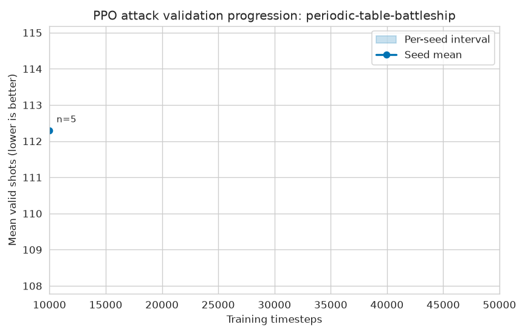
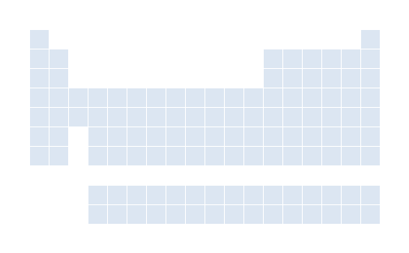
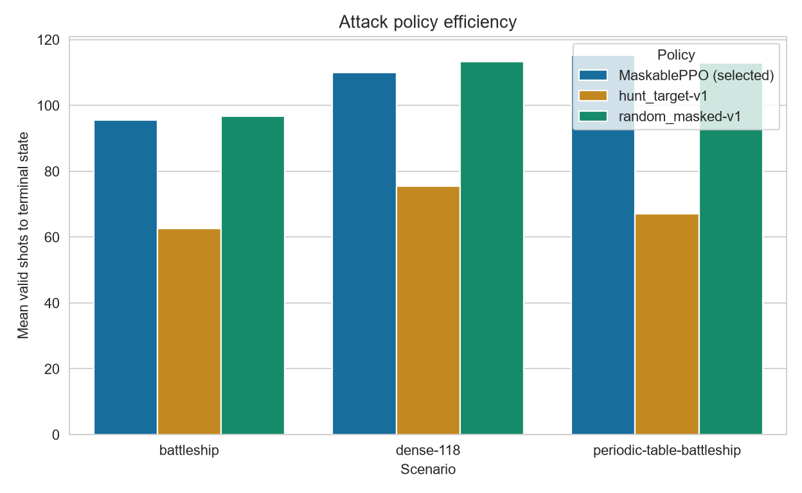
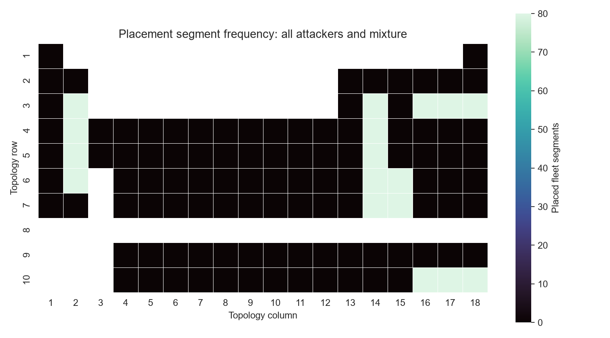

# Periodic Table Battleship RL

[](https://github.com/djairofilho/periodic-table-battleship-rl/actions/workflows/ci.yml)
[](LICENSE)
[](https://github.com/djairofilho/periodic-table-battleship-rl/commits/main)

Ambiente [Gymnasium](https://gymnasium.farama.org/) e protocolo de benchmark
para treinar agentes de reinforcement learning em uma Batalha Naval cuja grade
é a tabela periódica.

O projeto começa por uma comparação controlada com a Batalha Naval
tradicional. A pergunta é simples: como uma topologia irregular, com lacunas e
118 células válidas, muda o aprendizado de uma política de busca?

## Estado

O núcleo reproduzível está disponível: topologias, frotas legais, ambientes
Gymnasium mascarados de ataque e posicionamento, baselines, persistência de
resultados, renderização pública de episódios e o microambiente tabular de
Q-learning/SARSA. A campanha piloto controlada v0.2 também está concluída,
com PPO mascarado, avaliação cega, tabelas, gráficos e GIFs públicos. O passo
seguinte é ampliar o orçamento de treino, mantendo o mesmo protocolo.

## Cenários

| Cenário | Grade | Células jogáveis | Regra comum |
| --- | ---: | ---: | --- |
| `battleship` | 10 × 10 | 100 | Frota `2, 3, 3, 4, 5` |
| `periodic-table-battleship` | 10 × 18 | 118 | Frota `2, 3, 3, 4, 5` |
| `dense-118` | 10 × 18 | 118 | Controle conectado, sem lacunas internas |

Em ambos os casos, navios são lineares e ortogonais, não se sobrepõem e podem
encostar. No cenário periódico, uma célula corresponde a um elemento. As
lacunas da tabela não são alvos. O agente enfrenta uma frota adversária
amostrada de forma legal, sem acesso ao seu estado secreto.

O espaço de ação será comum: uma posição em uma tela de `10 × 18`. Uma máscara
de ação elimina lacunas, células fora da grade do cenário e tiros repetidos.
Isso mantém a API compatível e impede que escolhas impossíveis contaminem o
treinamento.

## Experimentos

1. **Ataque:** a frota adversária é posicionada por uma política aleatória
   legal. O agente aprende onde atirar a partir de acertos e erros anteriores.
2. **Posicionamento:** um agente posiciona a própria frota e tenta maximizar o
   número de tiros necessários para que atacantes de uma suíte fixa a encontrem.

Os dois experimentos são independentes na primeira rodada. O segundo começa
contra atacantes fixos para que a recompensa seja estável. Self-play só entra
depois, como extensão.

## Resultados da campanha v0.3

A campanha controlada v0.3 está concluída. Ela usa HPO estritamente em
treino/validação, cinco seeds finais por cenário, checkpoints selecionados
somente na validação e 100 seeds cegos de teste. O protocolo, dados por
episódio e relatório completo estão em
[docs/11-protocolo-v0.3.md](docs/11-protocolo-v0.3.md),
[docs/12-relatorio-v0.3.md](docs/12-relatorio-v0.3.md),
[runs/v0.3-fixed-suite](runs/v0.3-fixed-suite) e
[artifacts/v0.3-fixed-suite](artifacts/v0.3-fixed-suite).

No ataque, menos tiros é melhor. O MaskablePPO ficou melhor que a política
aleatória, mas não superou `hunt-target` em nenhum cenário. A diferença é PPO
menos hunt-target: valores positivos favorecem hunt-target, e todos os
intervalos bootstrap de 95% ficam acima de zero.

| Cenário | PPO | Hunt-target | Diferença PPO − hunt (IC 95%) |
| --- | ---: | ---: | ---: |
| `battleship` | 94,23 | 61,75 | +32,48 [+29,43; +35,57] |
| `dense-118` | 111,60 | 71,62 | +39,98 [+37,03; +43,00] |
| `periodic-table-battleship` | 110,78 | 69,33 | +41,45 [+37,87; +44,91] |


No posicionamento, mais tiros para afundar a frota é melhor. Contra a mistura
fixa de aleatório, hunt-target e PPO congelado, o PPO de posicionamento não
demonstrou vantagem estatisticamente robusta sobre nenhum baseline: todos os
intervalos bootstrap de 95% das comparações pareadas cruzam zero. Este é um
resultado útil, não uma falha omitida: ele motiva as ablações e o self-play da
próxima fase.


Os replays e curvas usam somente estado público e preservam a frota adversária
oculta durante o episódio.






## Resultados rápidos da campanha v0.2

Esta é uma campanha piloto controlada, não uma alegação de desempenho final:
três seeds de treino, 2.048 passos PPO por seed, cinco seeds de validação para
seleção e 20 seeds cegos de teste. O protocolo completo está em
[docs/09-protocolo-campanha-v0.2.md](docs/09-protocolo-campanha-v0.2.md) e os
dados públicos em [runs/v0.2-controlled](runs/v0.2-controlled) e
[artifacts/v0.2-controlled](artifacts/v0.2-controlled).

No ataque, menos tiros é melhor. O PPO selecionado ainda ficou próximo da
baseline aleatória e atrás do hunt-target em todos os cenários. A última
coluna é PPO menos hunt-target, com IC bootstrap percentil de 95% por seed.

| Cenário | PPO | Hunt-target | Diferença PPO − hunt (IC 95%) |
| --- | ---: | ---: | ---: |
| `battleship` | 95,60 | 62,65 | +32,95 [+27,15; +38,95] |
| `dense-118` | 110,00 | 75,45 | +34,55 [+26,40; +42,35] |
| `periodic-table-battleship` | 115,20 | 67,15 | +48,05 [+40,40; +55,20] |



No posicionamento, mais tiros para afundar a frota é melhor. O agente foi
treinado e testado contra uma mistura equiponderada de atacante aleatório,
hunt-target e PPO congelado; todas as linhas abaixo têm 20 episódios cegos.

| Cenário | Hunt-target | PPO congelado | Mistura de três atacantes |
| --- | ---: | ---: | ---: |
| `battleship` | 67,30 | 97,00 | 86,60 |
| `periodic-table-battleship` | 64,20 | 116,00 | 97,60 |



Os GIFs usam somente estado público: o primeiro mostra um ataque PPO na
tabela periódica e o segundo, a construção sequencial da frota do agente de
posicionamento.


## Benchmark inicial dos baselines

O primeiro benchmark reproduzível usa 20 seeds (`1001` a `1020`) e cinco
episódios por seed em cada combinação. Os dados brutos, manifesto e resumo
estão em [`runs/initial-baselines-v0`](runs/initial-baselines-v0).

| Cenário | Política | Episódios | Média de tiros válidos |
| --- | --- | ---: | ---: |
| `battleship` | `random_masked-v1` | 100 | 95,57 |
| `battleship` | `hunt_target-v1` | 100 | 59,28 |
| `periodic-table-battleship` | `random_masked-v1` | 100 | 112,72 |
| `periodic-table-battleship` | `hunt_target-v1` | 100 | 70,00 |

Estes números são uma linha de base, não um resultado de treinamento. Cada
manifesto registra o commit, o hash de `uv.lock`, seeds e ambiente de execução.

## Artefatos visuais e smoke runs PPO

Os dados iniciais dos baselines já têm [CSV e tabela](artifacts/initial-baselines-v0/tables),
[gráfico comparativo](artifacts/initial-baselines-v0/figures/mean-valid-shots.png)
e [GIF público de ataque](artifacts/initial-baselines-v0/gifs/hunt-target-demo.gif).

Também há demonstrações ponta a ponta de PPO para
[ataque](runs/attack-ppo-smoke-v0) e
[posicionamento](runs/placement-ppo-smoke-v0), além de
[gráficos, heatmap e GIF](artifacts/placement-ppo-smoke-v0). Elas usam somente
512 passos de treino e servem para verificar o pipeline. Não devem ser
interpretadas como avaliação final de desempenho.

## Documentação

- [Análise do jogo de origem](docs/01-analise-do-jogo-origem.md)
- [Especificação do ambiente](docs/02-especificacao-do-ambiente.md)
- [Protocolo de benchmark](docs/03-protocolo-de-benchmark.md)
- [Roadmap](docs/04-roadmap.md)
- [Experimentos e visualizações](docs/05-experimentos-e-visualizacoes.md)
- [Execução, Issues e trabalho paralelo](docs/06-execucao-e-rastreamento.md)
- [Contratos e critérios de aceite](docs/07-contratos-e-criterios-de-aceite.md)
- [Relatório v0.1](docs/08-relatorio-v0.1.md)
- [Protocolo e resultados v0.2](docs/09-protocolo-campanha-v0.2.md)
- [Relatório da campanha v0.2](docs/10-relatorio-v0.2.md)
- [Protocolo da campanha v0.3](docs/11-protocolo-v0.3.md)
- [Relatório da campanha v0.3](docs/12-relatorio-v0.3.md)
- [Referências](docs/referencias.md)

## Desenvolvimento

O projeto usa [uv](https://docs.astral.sh/uv/) e Python 3.11.

```powershell
uv sync --all-groups --extra visual
uv run ruff check .
uv run pytest
```

Para treinar PPO, acrescente `--extra train`. As dependências de visualização e
treino continuam opcionais; o núcleo do ambiente fica leve, baseado em
`gymnasium` e `numpy`.

## Escopo inicial

- Dois experimentos: ataque e posicionamento de frota.
- Baselines reproduzíveis: aleatório e hunt-target.
- Q-learning e SARSA em tabuleiros reduzidos; MaskablePPO nos cenários reais.
- Tabelas, gráficos Seaborn e GIFs determinísticos de partidas avaliadas.
- Avaliação por sementes fixas, métricas de eficiência e relatórios versionados.

O posicionamento por RL, o jogo competitivo entre dois agentes e recursos
educacionais da interface original são extensões futuras.

## Licença

Distribuído sob a [Licença MIT](LICENSE).
