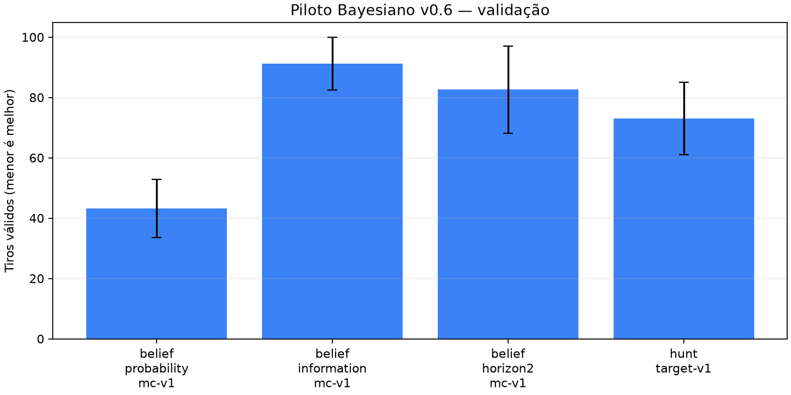
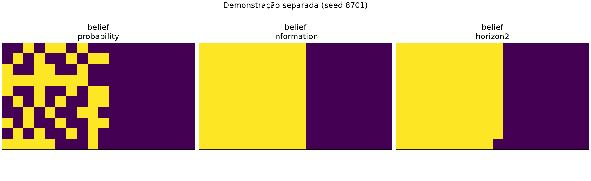

# Piloto Bayesiano v0.6: validação

Este é um piloto de validação, sem acesso ao teste cego. As frotas do
planejador Monte Carlo são compatíveis com o histórico público, mas a
distribuição proposta por backtracking não é declarada como posterior exato.

- Seeds de validação: `[8601, 8602, 8603, 8604, 8605]`
- Seed de demonstração: `8701`
- Amostras por decisão: `16`
- Revisão de origem: `c0d53f30fa58328a45be6fa3da7ba97fb5155919-dirty`

| Política | Tiros válidos médios | Desvio entre seeds |
| --- | ---: | ---: |
| `belief_probability_mc-v1` | 43.20 | 9.58 |
| `belief_information_mc-v1` | 91.20 | 8.64 |
| `belief_horizon2_mc-v1` | 82.60 | 14.50 |
| `hunt_target-v1` | 73.00 | 12.00 |

A figura de demonstração usa seed separada e é ilustrativa, não
evidência para promoção.
