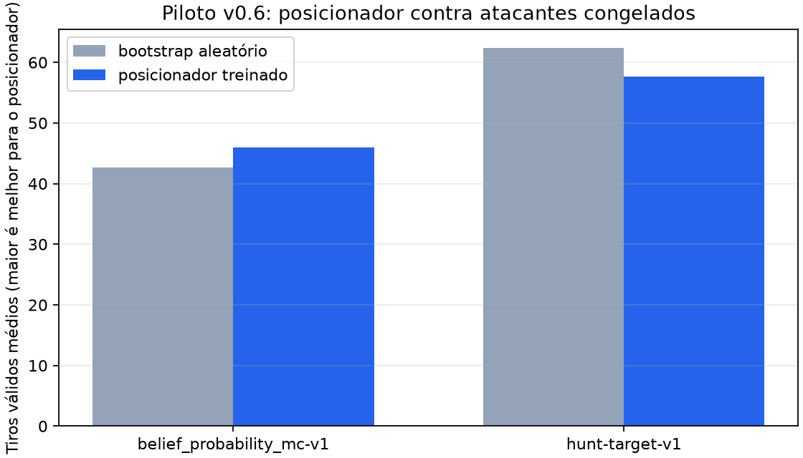

# Piloto de self-play Bayesiano v0.6

Este piloto executa uma atualização de posicionamento contra o planejador
Bayesiano de maior probabilidade congelado. Ele usa somente validação e
não abre o teste cego.

- Seeds de validação: `[8611, 8612, 8613]`
- Amostras Monte Carlo por decisão: `8`
- Budget de treino do posicionador: `64` passos
- Snapshot produzido: `v06-bayesian-selfplay-placement-pilot-placer-round-000`

| Atacante congelado | Bootstrap aleatório | Posicionador treinado | Diferença |
| --- | ---: | ---: | ---: |
| `belief_probability_mc-v1` | 42.67 | 46.00 | +3.33 |
| `hunt-target-v1` | 62.33 | 57.67 | -4.67 |

Os valores são evidência de validação de uma única atualização, não
uma decisão de promoção. A proveniência da liga e os hashes estão no
arquivo JSON ao lado deste relatório.
