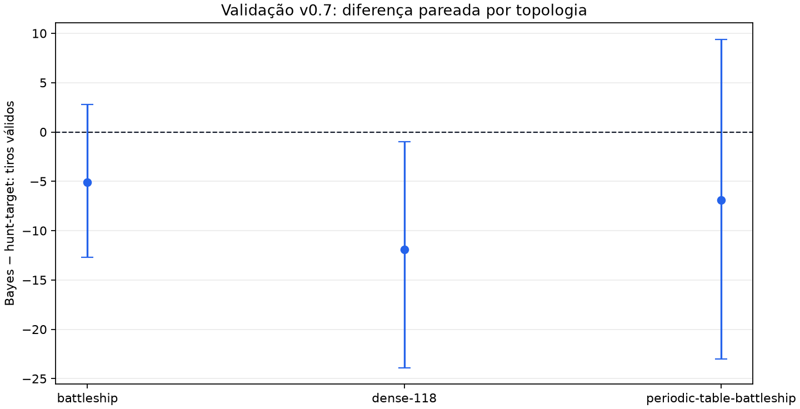

# Validação Bayesiana v0.7 entre topologias

Esta campanha usa somente seeds de validação pré-registradas. Ela não
abre, cria ou consome inventário de teste cego.

- Schema: `bayes-cross-topology-validation-v1`
- Seeds: `[8801, 8802, 8803, 8804, 8805, 8806, 8807, 8808, 8809, 8810]`
- Amostras Monte Carlo por decisão: `16`
- Estatística: bootstrap percentil pareado por seed, 95% bilateral.
- O amostrador gera frotas compatíveis, mas não declara posterior exato.

Menos tiros é melhor. Intervalo inteiramente abaixo de zero favorece a
política Bayesiana sobre `hunt_target-v1` nesta validação.

| Topologia | Bayes | Hunt-target | Bayes − hunt-target, IC 95% |
| --- | ---: | ---: | ---: |
| `battleship` | 46.00 | 51.10 | -5.10 [-12.70; +2.80] |
| `dense-118` | 50.20 | 62.10 | -11.90 [-23.90; -1.00] |
| `periodic-table-battleship` | 57.80 | 64.70 | -6.90 [-23.00; +9.40] |

