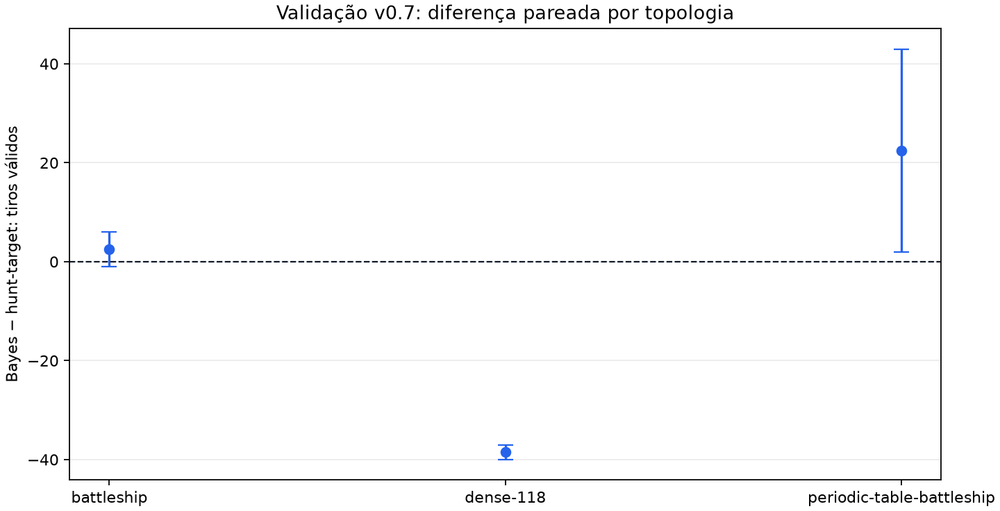

# Validação Bayesiana v0.7 entre topologias

Esta campanha usa somente seeds de validação pré-registradas. Ela não
abre, cria ou consome inventário de teste cego.

- Schema: `bayes-cross-topology-validation-v1`
- Seeds: `[8801, 8802]`
- Amostras Monte Carlo por decisão: `16`
- Estatística: bootstrap percentil pareado por seed, 95% bilateral.
- O amostrador gera frotas compatíveis, mas não declara posterior exato.

Menos tiros é melhor. Intervalo inteiramente abaixo de zero favorece a
política Bayesiana sobre `hunt_target-v1` nesta validação.

| Topologia | Bayes | Hunt-target | Bayes − hunt-target, IC 95% |
| --- | ---: | ---: | ---: |
| `battleship` | 48.50 | 46.00 | +2.50 [-1.00; +6.00] |
| `dense-118` | 46.00 | 84.50 | -38.50 [-40.00; -37.00] |
| `periodic-table-battleship` | 66.50 | 44.00 | +22.50 [+2.00; +43.00] |

