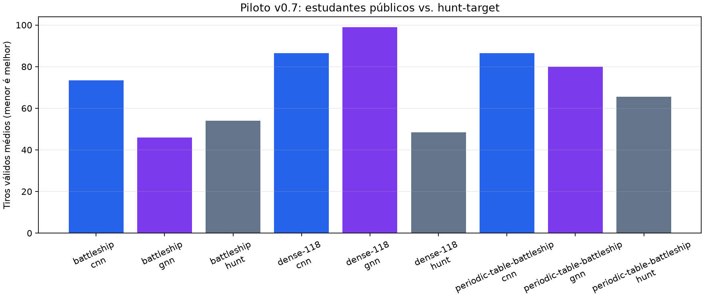

# Piloto de estudantes neurais Bayesianos v0.7

CNN e GNN recebem exclusivamente observações públicas e máscara legal. As seeds de treino e validação são distintas; nenhum teste cego foi aberto.

- Seeds de treino: `[9601, 9602]`
- Seeds de validação: `[9651, 9652]`
- Promoção: **rejeitada neste piloto**. Pilot with two held-out seeds only; promotion requires the separately pre-registered multi-seed validation gate.

| Topologia | Estudante | Acordo com professor | Tiros | Hunt-target |
| --- | --- | ---: | ---: | ---: |
| `battleship` | `cnn` | 0.114 | 73.50 | 54.00 |
| `battleship` | `gnn` | 0.067 | 46.00 | 54.00 |
| `dense-118` | `cnn` | 0.017 | 86.50 | 48.50 |
| `dense-118` | `gnn` | 0.025 | 99.00 | 48.50 |
| `periodic-table-battleship` | `cnn` | 0.023 | 86.50 | 65.50 |
| `periodic-table-battleship` | `gnn` | 0.030 | 80.00 | 65.50 |

