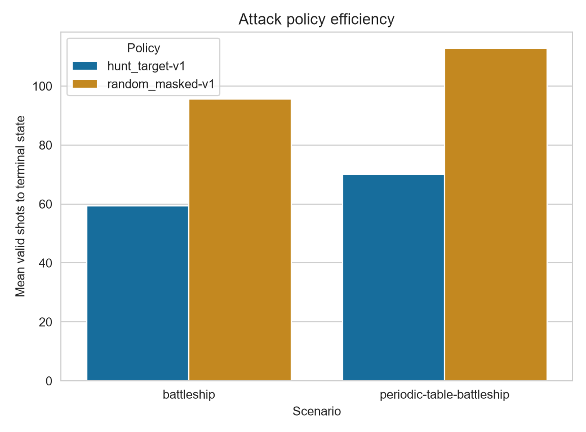
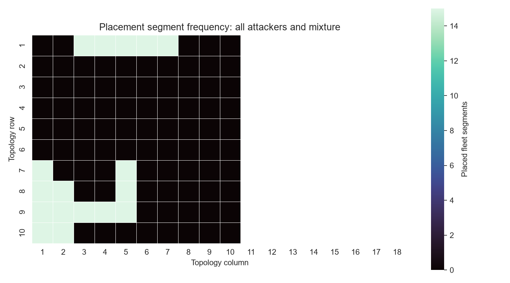

# Relatório v0.1

## Escopo da release

Esta release entrega o benchmark reproduzível de Batalha Naval clássica e de
Periodic Table Battleship, com ambientes Gymnasium mascarados, baselines,
pipelines MaskablePPO, avaliação cega, persistência de resultados e artefatos
visuais. O Project do GitHub registra o histórico de implementação e os dados
brutos ficam versionados em `runs/`.

## Baselines de ataque

O benchmark inicial executou 20 seeds (`1001` a `1020`) e cinco episódios por
seed, totalizando 100 episódios por combinação. `hunt_target-v1` foi mais
eficiente que `random_masked-v1` nos dois cenários.

| Cenário | Política | Média de tiros válidos |
| --- | --- | ---: |
| `battleship` | `random_masked-v1` | 95,57 |
| `battleship` | `hunt_target-v1` | 59,28 |
| `periodic-table-battleship` | `random_masked-v1` | 112,72 |
| `periodic-table-battleship` | `hunt_target-v1` | 70,00 |

Os detalhes por episódio estão em
[`runs/initial-baselines-v0`](../runs/initial-baselines-v0) e os artefatos
visuais em [`artifacts/initial-baselines-v0`](../artifacts/initial-baselines-v0).



## Smoke runs PPO

Foram executados smoke runs com 512 passos de treino para validar o caminho
completo de checkpoint, avaliação cega, persistência, tabelas, gráficos e GIFs.
Eles usam cinco seeds de teste e não sustentam uma conclusão científica sobre
desempenho ou convergência.

| Experimento | Cenário | Resultado principal |
| --- | --- | --- |
| Ataque PPO | `battleship` | 94,0 tiros válidos médios até vitória. |
| Posicionamento PPO | `battleship` | 75,0 tiros válidos médios até afundamento pela mistura. |

No posicionamento, a média por componente foi 95,0 contra
`random-masked-v1` e 50,4 contra `hunt-target-v1`. Os dados e manifestos estão
em [`runs/attack-ppo-smoke-v0`](../runs/attack-ppo-smoke-v0) e
[`runs/placement-ppo-smoke-v0`](../runs/placement-ppo-smoke-v0).



## Reprodução

```powershell
uv sync --all-groups --extra visual --extra train
uv run --extra visual ruff check .
uv run --extra visual pytest
```

As execuções registram a configuração, seeds, commit, hash de `uv.lock` e
inventário de episódios. Checkpoints locais ficam fora do Git; cada manifesto
guarda o hash do checkpoint usado na avaliação.

## Próxima iteração científica

Antes de comparar PPO com os baselines como resultado final, aumentaremos o
orçamento de treino, separaremos rigorosamente seeds de treino, validação e
teste e repetiremos a avaliação em ambos os cenários. Essa etapa também deve
reportar intervalos de confiança bootstrap e preservar checkpoints publicáveis.
