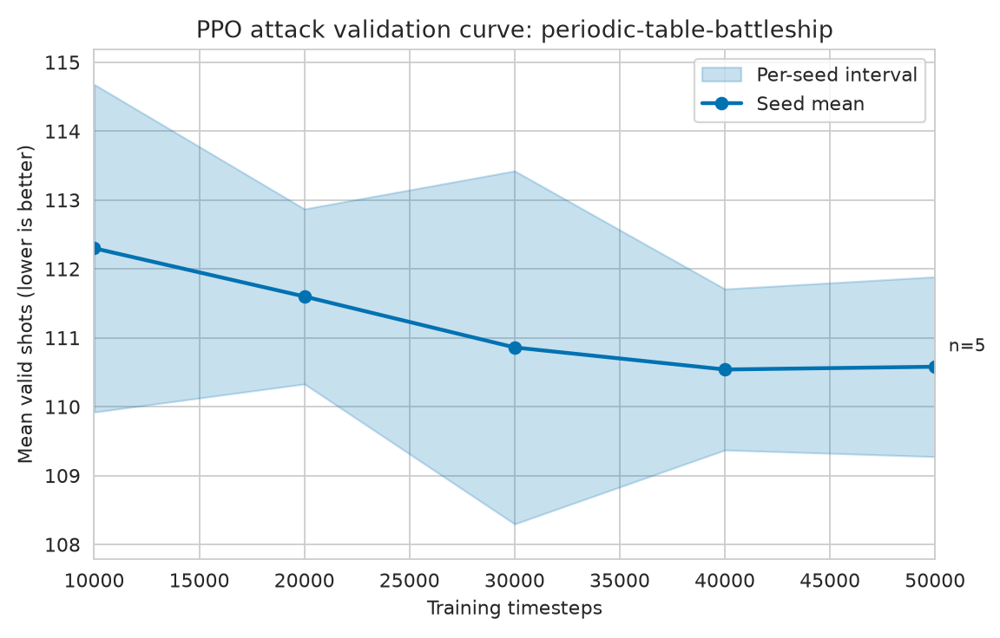
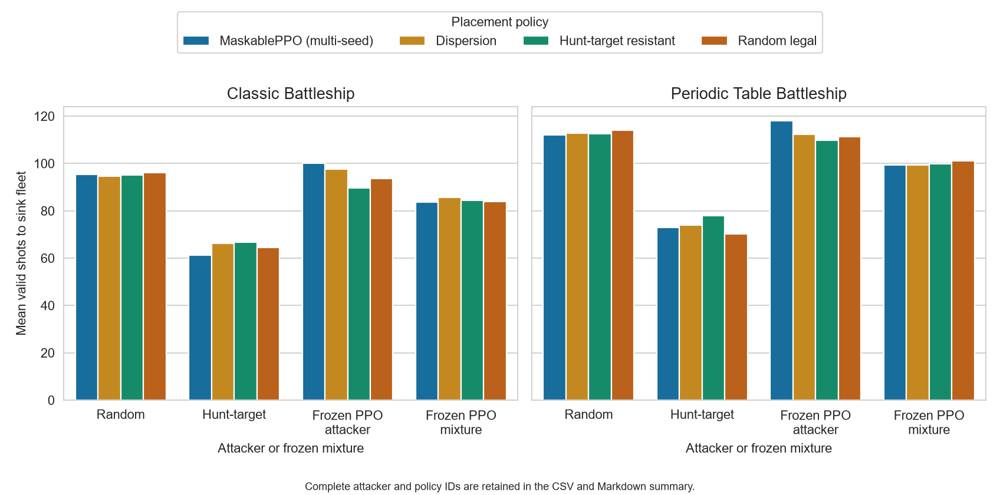
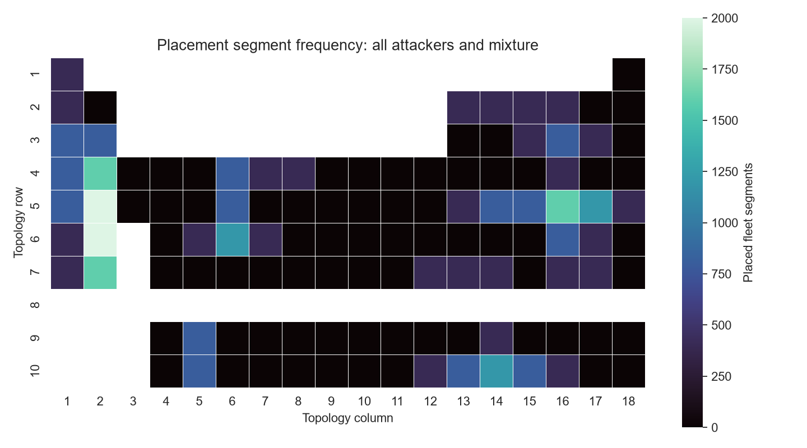

# Relatório v0.3: campanha controlada multi-seed

## Escopo executado

A campanha v0.3 executou uma busca pequena de hiperparâmetros de ataque em
três cenários, cinco treinos finais MaskablePPO por cenário e 100 seeds cegos
de teste. Para posicionamento, treinou cinco PPOs no clássico e cinco na
tabela periódica contra uma mistura equiponderada de atacante aleatório,
hunt-target e PPO congelado. As três baselines independentes de posicionamento
foram avaliadas nos mesmos seeds e contra os mesmos atacantes.

Treino, validação e teste usam seeds disjuntos. Taxa de aprendizado e
checkpoint foram escolhidos somente na validação. O commit executado foi
`7949ed8` e o relatório de máquina legível é
[`campaign-report.json`](../artifacts/v0.3-fixed-suite/campaign-report.json).

## Ataque

Menos `valid_shots` é melhor. A tabela agrega 500 episódios PPO, provenientes
de cinco políticas independentes, e 100 episódios de cada baseline. A
diferença pareada usa a média por seed: PPO menos hunt-target.

| Cenário | PPO | Aleatório | Hunt-target | PPO − hunt (IC 95%) |
| --- | ---: | ---: | ---: | ---: |
| Clássico | 94,23 | 95,37 | 61,75 | +32,48 [+29,43; +35,57] |
| `dense-118` | 111,60 | 112,69 | 71,62 | +39,98 [+37,03; +43,00] |
| Tabela periódica | 110,78 | 112,30 | 69,33 | +41,45 [+37,87; +44,91] |

O PPO melhorou marginalmente sobre o aleatório, mas ficou de forma robusta
atrás de hunt-target nos três cenários. O controle `dense-118` também fica
atrás de hunt-target, então os dados não sustentam uma vantagem do PPO nem uma
explicação atribuível somente às lacunas da tabela periódica.

## Posicionamento

Mais `valid_shots_to_sink` é melhor. A comparação principal usa a mistura
congelada; diferenças positivas significam PPO de posicionamento melhor que a
baseline. Nenhum intervalo bootstrap de 95% exclui zero.

| Cenário | PPO − dispersão (IC 95%) | PPO − resistente (IC 95%) | PPO − aleatório legal (IC 95%) |
| --- | ---: | ---: | ---: |
| Clássico | −2,09 [−7,10; +2,89] | −0,86 [−5,42; +3,82] | −0,40 [−5,54; +4,84] |
| Tabela periódica | +0,14 [−5,60; +5,93] | −0,43 [−6,01; +5,33] | −1,64 [−7,16; +4,10] |

Portanto, o PPO não demonstrou uma vantagem defensiva robusta contra a mistura
fixa. A avaliação por componente ainda é útil: no periódico, por exemplo, o
PPO obtém 118,00 tiros contra o atacante PPO congelado, mas isso não se
converte em melhoria confiável contra a mistura.

## Limitações e decisão

- A política heurística hunt-target continua muito mais eficiente que o PPO de
  ataque sob este orçamento e representação.
- O posicionamento é caro: cada ação consulta a mistura defensiva inteira;
  isso deve orientar a medição de throughput e a decisão de GPU, não justificar
  mudança retrospectiva de protocolo.
- Não foi usado self-play nesta release. A issue [#40](https://github.com/djairofilho/periodic-table-battleship-rl/issues/40)
  mantém uma liga de snapshots como próxima hipótese, sempre comparada com
  baselines congeladas.

As próximas issues começam pela análise por seed e ablações de recompensa e
observação, antes de aumentar o orçamento de treino.

## Artefatos reprodutíveis

- [Resultados por episódio](../artifacts/v0.3-fixed-suite/tables/attack-test-episodes.csv)
- [Resumo de ataque](../artifacts/v0.3-fixed-suite/tables/attack-test-summary.md)
- [Resultados de posicionamento](../artifacts/v0.3-fixed-suite/tables/placement-test-episodes.csv)
- [Resumo de posicionamento](../artifacts/v0.3-fixed-suite/tables/placement-test-summary.md)
- [Manifests e JSONL](../runs/v0.3-fixed-suite)
