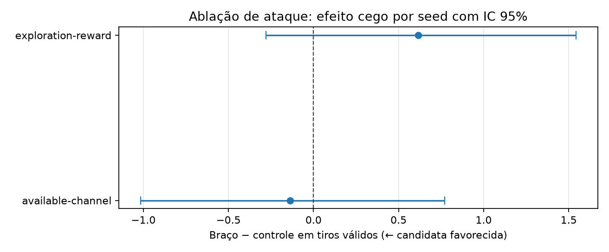

# Ablação v0.4: recompensa e representação do atacante

## Pergunta e decisão prévia

A campanha v0.3 mostrou que o MaskablePPO de ataque fica bem atrás de
hunt-target. Esta ablação testa duas explicações modificáveis, sem alterar a
frota aleatória, a topologia periódica, a máscara de ações, os hiperparâmetros
de PPO ou o protocolo de avaliação.

| Braço | Mudança única | Hipótese |
| --- | --- | --- |
| `control-v03` | Nenhuma: quatro planos e recompensa v0.3 | Referência reexecutada sob o novo calendário. |
| `exploration-reward` | Penalidade de erro de `-1,0` para `-0,2` | Uma exploração menos punida deixa o PPO converter acertos em menos tiros. |
| `available-channel` | Quinto plano público: ações válidas ainda não chamadas | A estimativa de valor melhora sem expor a frota. |

O canal adicional é uma cópia da máscara pública de ações na grade `10×18`.
Ele não contém ocupação, identidade de navio nem qualquer outra informação
privada. A recompensa alternativa preserva `+1` para acerto e o bônus terminal
de 17 segmentos; somente o custo imediato de erro muda.

## Protocolo executado

O estudo completo foi executado em CPU, uma thread PyTorch, no commit
`953a79a46470fec06803e20b0b35d5eea877d592`:

| Item | Valor |
| --- | --- |
| Cenário | `periodic-table-battleship` |
| Braços | 3, uma intervenção por vez |
| Treino | 3 seeds por braço, 20 mil passos cada |
| Validação | 10 seeds; checkpoints em 10k e 20k |
| Seleção | Menor média de `valid_shots` na validação; desempate pelo checkpoint anterior |
| Teste cego | 100 seeds, uma execução por política treinada |
| Unidade estatística | Média das três políticas dentro de cada seed cego |
| Intervalo | Bootstrap percentil bilateral de 95%, 10 mil reamostragens |

Treino, validação e teste usam inventários de seeds disjuntos. O teste recebe
apenas a observação Gymnasium e a máscara de ações. Os checkpoints ficam em
`.local-runs/v0.4-attack-ablation`; os manifests e episódios públicos ficam em
[`runs/v0.4-attack-ablation`](../runs/v0.4-attack-ablation).

Para reproduzir:

```powershell
uv run --extra train --extra visual python scripts/run_attack_ablation.py
```

O modo `--smoke` mantém o mesmo fluxo, mas é somente uma verificação de
integração, não uma evidência para decisão.

## Resultado

Menos `valid_shots` é melhor. Cada média agrega 300 episódios: três políticas
independentes avaliadas nos mesmos 100 seeds cegos.

| Braço | Média de tiros válidos | Diferença vs. controle (IC 95%) | Leitura |
| --- | ---: | ---: | --- |
| `control-v03` | 111,05 | — | Referência |
| `available-channel` | 110,91 | −0,14 [−1,02; +0,77] | Inconclusivo |
| `exploration-reward` | 111,67 | +0,62 [−0,28; +1,54] | Inconclusivo |

Nenhum intervalo exclui zero. Portanto, neste orçamento não há evidência de
que suavizar a penalidade de erro ou repetir a disponibilidade de ações na
observação resolva a lacuna frente a hunt-target. O canal adicional tem média
numericamente menor, mas o efeito é pequeno e incerto; não deve substituir o
controle nem justificar aumento de escala por si só.



Os artefatos auditáveis são:

- [`ablation-report.json`](../artifacts/v0.4-attack-ablation/ablation-report.json),
  com protocolo, braços, checkpoints escolhidos, resumos e intervalos.
- [`ablation-summary.md`](../artifacts/v0.4-attack-ablation/ablation-summary.md),
  tabela compacta dos resultados.
- [`attack-test-episodes.csv`](../artifacts/v0.4-attack-ablation/attack-test-episodes.csv),
  resultados públicos por episódio.
- [`attack-test-summary.md`](../artifacts/v0.4-attack-ablation/attack-test-summary.md),
  agregação por política.
- [`ablation-comparison.png`](../artifacts/v0.4-attack-ablation/ablation-comparison.png),
  visualização dos intervalos pareados.

## Limites e próxima decisão

Esta é uma ablação de mecanismo, não uma nova busca de hiperparâmetros nem
uma comparação com adversário adaptativo. Ela não mede self-play, generalização
entre topologias ou um orçamento maior. A decisão correta é manter a
configuração v0.3 como controle e usar o resultado negativo para priorizar a
avaliação de escala e de self-play, ambas registradas em issues próprias.
