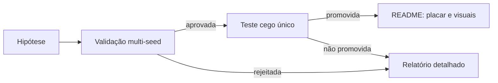

# Apresentação de resultados v0.5

O README é o placar executivo: apresenta somente controles e candidatas
promovidas por validação e teste cego. Relatórios de cada técnica preservam a
hipótese, a configuração, o inventário de seeds, os dados por episódio e os
gráficos completos.

## Perguntas e visuais

| Pergunta | Visual | Onde aparece |
| --- | --- | --- |
| A política melhorou com treino? | Curva por checkpoint e seed | Relatório do experimento |
| A diferença é robusta? | Forest plot pareado com IC 95% | Relatório e README se promovida |
| Ela usa informação após acerto? | Heatmap de tiros e GIF na mesma seed | Relatório |
| A topologia muda o comportamento? | Heatmap com lacunas e matriz treino×teste | Relatório e README |
| Qual é o melhor resultado geral? | Tabela de placar por cenário | README |

GIFs usam seeds de demonstração separadas e não decidem promoção. Cada figura
deve indicar cenário, política, split, seed ou agregação, commit e versão do
protocolo.
