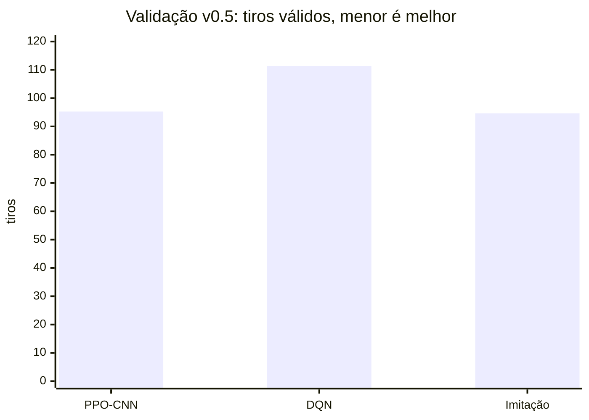

# Relatório de validação v0.5

Nenhuma candidata v0.5 foi promovida ao teste cego. Menos tiros é melhor.
Todos os resultados abaixo pertencem exclusivamente ao split de validação.

| Candidata | Cenário | Treino | Melhor validação | Referência | Decisão |
| --- | --- | --- | ---: | ---: | --- |
| PPO-CNN | clássico | 3 seeds, 50 mil passos | 95,27 | hunt-target 61,75 | Rejeitar |
| DQN mascarado | periódico | 3 seeds, 20 mil passos | 111,37 | hunt-target 59,10 | Rejeitar |
| Imitação hunt-target | clássico | 3 seeds, 50 mil passos | 94,60 | hunt-target 69,80 | Rejeitar |
| GNN | periódico | smoke arquitetural | não treinado | — | Não elegível |

O DQN ficou +52,27 tiros acima de hunt-target nas mesmas seeds, com IC 95%
bootstrap [39,13; 64,37]. A imitação não transferiu a eficiência da heurística:
o clone foi a melhor variante, mas usou +24,80 tiros. A CNN ficou +33,52 tiros
acima de hunt-target. Logo, o self-play acoplado permanece implementado, porém
não é executado como campanha competitiva nesta release: seu gate exige uma
candidata aprovada na validação.

Os checkpoints e logs de validação são locais por não serem resultados
promovidos. O código, protocolo, runners e testes permanecem versionados.
