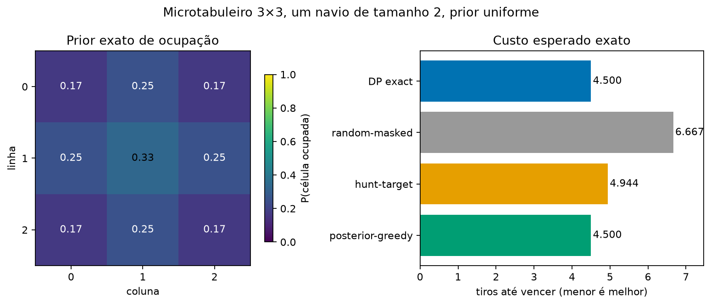

# Oráculo exato no microtabuleiro

Esta etapa cria uma referência matemática para decisões de ataque antes de
aplicar aproximações ao tabuleiro completo. O escopo é propositalmente pequeno:
grade 3×3, um navio ortogonal de tamanho 2 e prior uniforme sobre todas as
frotas físicas legais. Navios podem encostar no benchmark principal; isso não
altera este microcaso de um único navio.



## O que é resolvido exatamente

Há 12 posições legais para o navio. Depois de cada tiro, o agente observa
somente `miss`, `hit` ou `win`. O estado do solver é a crença pública:

```text
candidate_ids: frotas ainda compatíveis com os resultados observados
tried_mask: células públicas que já receberam tiro
hit_mask: células públicas que resultaram em acerto
```

Ele não contém a frota sorteada da partida. Como cada frota compatível tinha o
mesmo peso no prior e o resultado de um tiro é determinístico para uma frota,
a posterior é uniforme no subconjunto compatível.

Para cada estado público `h`, o valor calcula o número mínimo esperado de tiros
adicionais:

```text
V(h) = min over a in A(h) of (
  1 + sum over public outcomes o of P(o | h, a) * V(next(h, a, o))
)
```

`win` não possui custo futuro. A implementação memoiza `V(h)` e resolve todos
os ramos alcançáveis, sem amostragem Monte Carlo. Isto é programação dinâmica
exata para este POMDP finito reduzido.

## Resultado reproduzível

| Política | Tiros esperados | Arrependimento contra o ótimo |
| --- | ---: | ---: |
| Oráculo de programação dinâmica | 4,500 | 0,000 |
| `posterior-greedy` | 4,500 | 0,000 |
| `hunt-target` | 4,944 | 0,444 |
| `random-masked` | 6,667 | 2,167 |

As cinco primeiras ações ótimas são as células não-canto: índices
row-major `1`, `3`, `4`, `5` e `7`. O centro possui probabilidade inicial de
ocupação `4/12 = 0,333`; bordas não-canto têm `3/12 = 0,250`; cantos têm
`2/12 = 0,167`.

Neste caso reduzido, escolher a célula de maior probabilidade posterior empata
com o ótimo. Isso é uma propriedade medida deste microcaso, não uma alegação de
que `posterior-greedy` é ótimo no tabuleiro completo ou para frotas múltiplas.
O `hunt-target` já melhora muito sobre aleatório, mas sua escolha uniforme entre
vizinhos depois de um acerto deixa custo esperado adicional.

Os dados literais estão em
[comparison.csv](../artifacts/v0.6-micro-oracle/comparison.csv) e
[oracle-report.json](../artifacts/v0.6-micro-oracle/oracle-report.json).
O relatório registra 2.353 estados públicos memoizados.

## Reexecução e limites

```powershell
uv run --extra visual python scripts/run_micro_oracle.py
uv run pytest tests/oracle
```

O microtabuleiro valida a formulação e os testes de correção, não substitui a
avaliação cega das topologias reais. A enumeração e a árvore de crenças crescem
combinatoriamente quando se adicionam células ou navios. As próximas etapas são
usar o mesmo contrato para: crença exata onde ainda couber, amostragem de frotas
compatíveis no tabuleiro real e planejamento de horizonte limitado.
