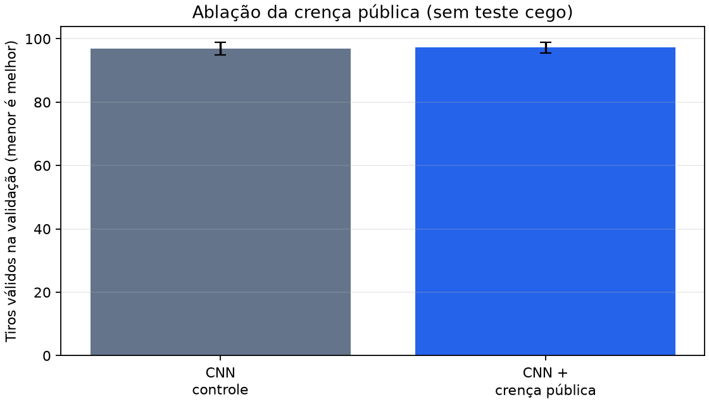

# Política neural híbrida de crença pública v0.6

## Hipótese

O controle CNN recebe os canais públicos usuais de resultados. A candidata
`maskable-ppo-cnn-public-belief-v1` preserva a mesma CNN, orçamento de PPO e
máscara de ações, mas acrescenta dois planos calculados pelo módulo `belief`:

1. probabilidade estimada de ocupação para cada tiro ainda legal;
2. entropia binária dessa estimativa, isto é, incerteza do resultado.

Isso testa se uma rede pode aproveitar uma representação explícita de
hipóteses de frota, sem alegar que o amostrador Monte Carlo seja posterior
Bayesiano exato.

## Segurança de informação

`BeliefAugmentedAttackEnv` recebe somente a observação já pública de
`AttackEnv` e `action_masks()`. A cada estado, ele reconstrói
`PublicAttackState`, gera frotas compatíveis por `constrained-backtracking-v1`
e zera ambos os mapas em células indisponíveis. Ele não lê `_fleet`, IDs
privados de navios ou ocupação oculta.

O metadado de treinamento persiste:

- `posterior_exact: false`;
- tamanho da amostra e limites de restart/backtracking;
- versão do esquema dos mapas;
- identidade distinta da política e configuração pública do ambiente.

## Ablação e protocolo

A ablação é CNN controle versus CNN com crença. Ambas usam a mesma topologia,
PPO, arquitetura espacial, seeds de treino, orçamento e agenda de validação.
O único tratamento é a inclusão dos dois canais de crença.

Execute um smoke end-to-end sem abrir o teste cego:

```powershell
uv run --extra train --extra visual python scripts/run_hybrid_belief_ablation.py --smoke
```

Ou execute o piloto de validação configurado:

```powershell
uv run --extra train --extra visual python scripts/run_hybrid_belief_ablation.py --timesteps 10000 --sample-count 8
```

O relatório fica em
`artifacts/v0.6-hybrid-belief-pilot/hybrid-belief-ablation-report.json`, com o
gráfico comparativo `hybrid-belief-ablation.png`. Menos tiros é melhor. O runner declara `blind_test_used: false` e
`promotion_eligible: false`; portanto seus resultados não podem substituir o
placar principal, selecionar uma release ou justificar promoção.

Para uma candidata promissora, o próximo passo é pré-registrar uma campanha
multi-seed maior no contrato de promoção e só então solicitar uma confirmação
cega.

## Piloto de validação

O piloto reprodutível executado com 1.024 passos, três seeds de treino, três
seeds de validação e duas amostras compatíveis por decisão não abriu o teste
cego. A candidata usou **97,22** tiros válidos em média, enquanto o controle
CNN usou **96,89**. Como menos é melhor, a diferença candidata menos controle
foi **+0,33 tiro**: não há sinal de melhoria neste orçamento e a candidata não
é promovida.



O gráfico mostra o desvio entre as três seeds de treino; ele é uma leitura de
validação, não uma estimativa final nem uma comparação com `hunt-target`.
