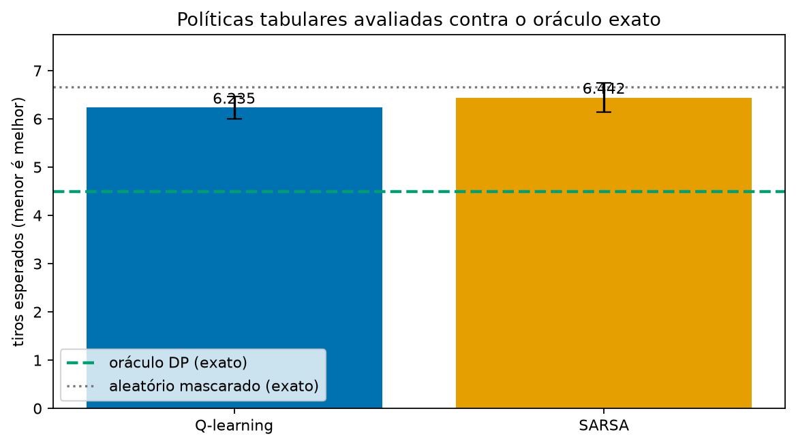

# Q-learning e SARSA contra o oráculo do microtabuleiro

Esta comparação testa os dois algoritmos tabulares nas mesmas regras do
oráculo: uma grade 3 × 3, um navio ortogonal de comprimento 2 e prior uniforme
sobre as 12 frotas legais. O treino recebe somente o resultado público de cada
tiro. A observação é uma codificação ternária por célula: desconhecida, água ou
acerto. A frota escondida nunca faz parte do estado observado nem da tabela Q.



## Protocolo

- Quatro seeds pareadas: `7101` a `7104`.
- 5.000 episódios por seed e por algoritmo.
- `alpha=0,15`, `gamma=1`, epsilon linear de `0,30` até `0,02`.
- Recompensa de `-1` a cada tiro legal, de modo que maximizar o retorno equivale
  a minimizar tiros até vencer.
- Depois do treino, cada política gulosa é pontuada por enumeração exata das 12
  frotas, com desempates uniformes. Portanto, a coluna de tiros esperados não
  é uma média Monte Carlo de avaliação.

## Resultado

| Política | Tiros esperados | Regret contra DP |
| --- | ---: | ---: |
| Oráculo de programação dinâmica | 4,500 | 0,000 |
| Aleatória mascarada, exata | 6,667 | 2,167 |
| Q-learning, média de quatro seeds | 6,235 | 1,735 |
| SARSA, média de quatro seeds | 6,442 | 1,942 |

Q-learning ficou levemente melhor que SARSA nesta configuração, e ambos ficaram
melhores que a política mascarada aleatória. Nenhum alcançou o oráculo nem
superou `hunt-target` (4,944) com este orçamento. Isso é esperado: a tabela
possui até `3^9` observações públicas possíveis e a configuração usa somente
5.000 episódios por seed. O objetivo do artefato é validar a comparação
reproduzível e o cálculo exato de regret, não alegar um agente competitivo para
o tabuleiro completo.

## Reexecução

```powershell
uv run --extra visual python scripts/run_micro_rl_comparison.py
uv run pytest tests/algorithms/test_tabular.py tests/experiments/test_micro_rl.py
```

Os arquivos de dados estão em
[micro-rl-report.json](../artifacts/v0.6-micro-rl/micro-rl-report.json) e
[micro-rl-comparison.csv](../artifacts/v0.6-micro-rl/micro-rl-comparison.csv).
O relatório registra os hiperparâmetros, seeds, revisão Git e se a árvore de
trabalho estava modificada durante a execução.
