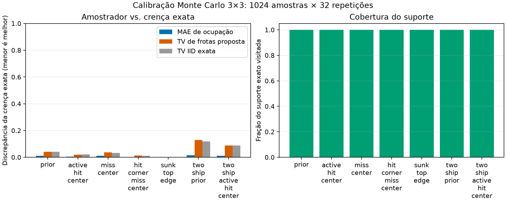

# Relatório v0.7: calibração, generalização e destilação

## Decisão da release

A v0.7 **não abre teste cego, não promove atacante e não expande self-play**.
Essa é a conclusão prevista pelo protocolo, não trabalho pendente. O
planejador Bayesiano e as estudantes neurais não cumpriram o gate de
generalização multi-topologia em validação.

## Calibração do professor Bayesiano

O amostrador `constrained-backtracking-v1` foi comparado ao posterior exato em
cinco estados de microtabuleiro e dois casos de dois navios, com 1.024 amostras
e 32 repetições. Ele visitou 100% do suporte exato e colocou massa zero fora
do suporte. Ainda assim, não é um posterior exato: no prior de dois navios, a
TV foi 0,12874 contra 0,11727 do controle IID, um excesso de 0,01147.

O resultado qualifica o professor como heurística pública auditável, mas não
como inferência Bayesiana exata no tabuleiro completo.

## Validação Bayesiana nos três cenários

Foram usadas dez seeds de validação, 16 amostras Monte Carlo por decisão e
bootstrap percentil pareado de 95%. Menos tiros é melhor.

| Cenário | Bayes | Hunt-target | Bayes − hunt, IC 95% |
| --- | ---: | ---: | ---: |
| `battleship` | 46,00 | 51,10 | −5,10 [−12,70; +2,80] |
| `dense-118` | 50,20 | 62,10 | −11,90 [−23,90; −1,00] |
| `periodic-table-battleship` | 57,80 | 64,70 | −6,90 [−23,00; +9,40] |

Somente `dense-118` tem intervalo inteiramente favorável. Logo o planejador
não passa a regra pré-registrada de generalização e não entra no teste cego.

## Destilação pública CNN e GNN

O dataset contém somente observação pública, máscara legal, ação e mapa de
ocupação do professor. CNN e GNN usam perda CE + KL com máscara estrita. O
piloto determinístico de duas seeds não promove nenhuma estudante:

| Cenário | CNN | GNN | Hunt-target |
| --- | ---: | ---: | ---: |
| `battleship` | 62,00 | 64,00 | 54,00 |
| `dense-118` | 69,00 | 61,00 | 48,50 |
| `periodic-table-battleship` | 70,50 | 52,00 | 65,50 |

A GNN melhora pontualmente na tabela periódica, mas perde nos outros cenários.
O piloto também é menor que a validação multi-seed exigida pelo gate.

## Integridade experimental

Nenhuma rotina v0.7 consumiu seeds cegas. Os relatórios de calibração e
validação principais foram reexecutados com árvore Git limpa e registram o
commit de origem. O estudante também foi executado duas vezes com a mesma
configuração e produziu o mesmo SHA-256 do relatório.

## Próxima hipótese

A próxima release não deve apenas aumentar epochs. Primeiro deve reduzir o
viés do professor ou usar uma aproximação posterior melhor, ampliar o dataset
de demonstrações e repetir uma validação multi-seed de destilação. Só um ganho
robusto em pelo menos dois cenários justifica criar um novo teste cego.
