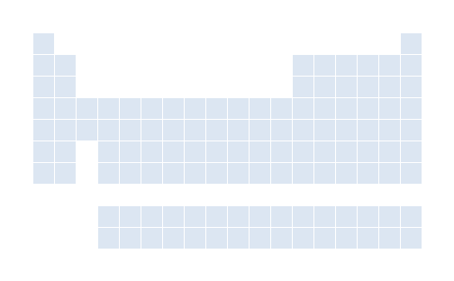
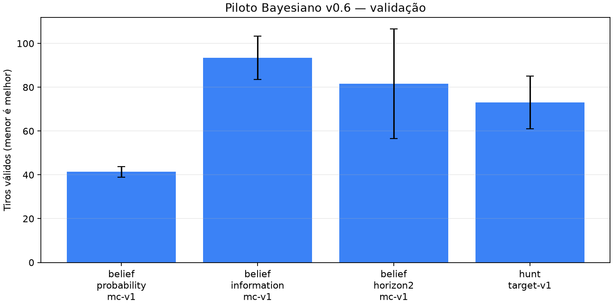
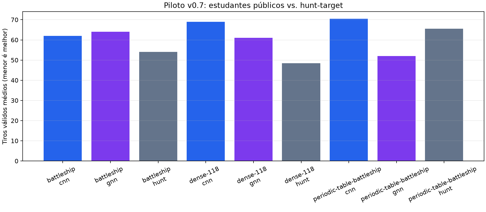

# Galeria de jogos e visualizações

## Replays

As demonstrações abaixo são públicas e usam apenas estado visível.

## Comparações por política (validação pública)

## Visão curta por método

- **Bayesiano:** calor de decisões concentradas e estabilidade de busca.
- **Híbrido:** resultados menos consistentes no conjunto completo.
- **Neurais:** úteis para análise de custo, ainda sem ganho robusto de promoção.

