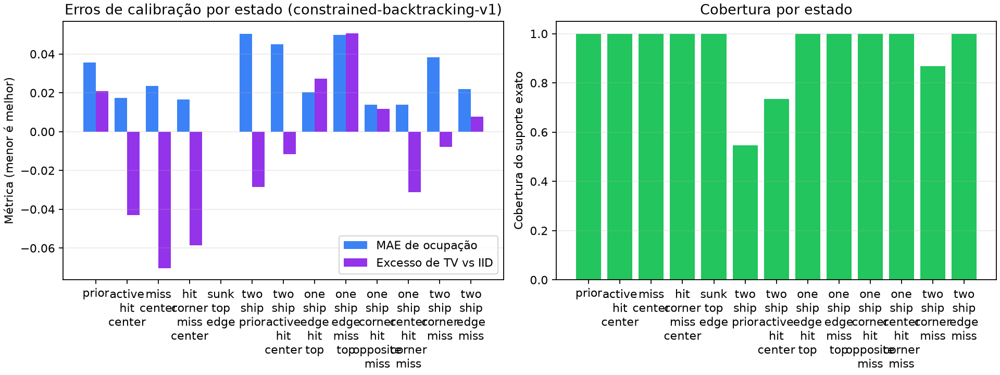
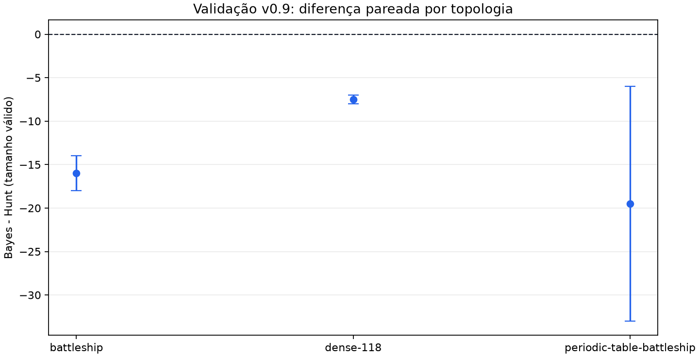
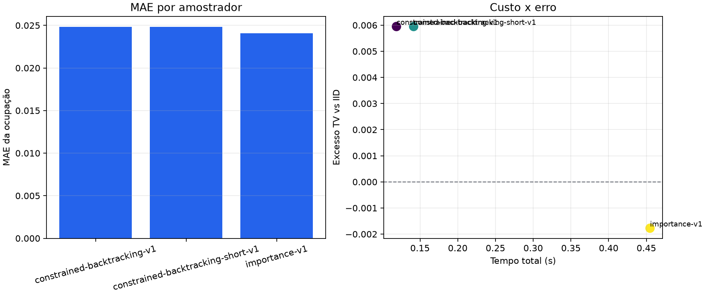
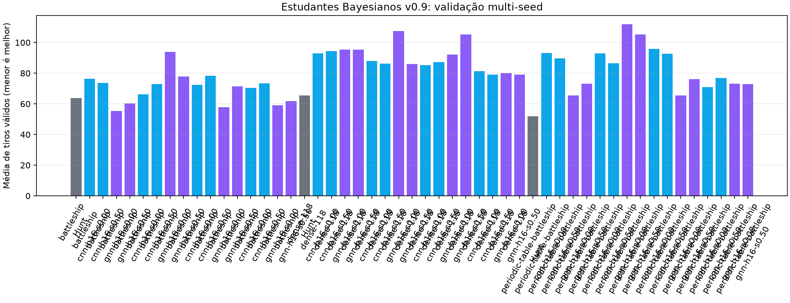
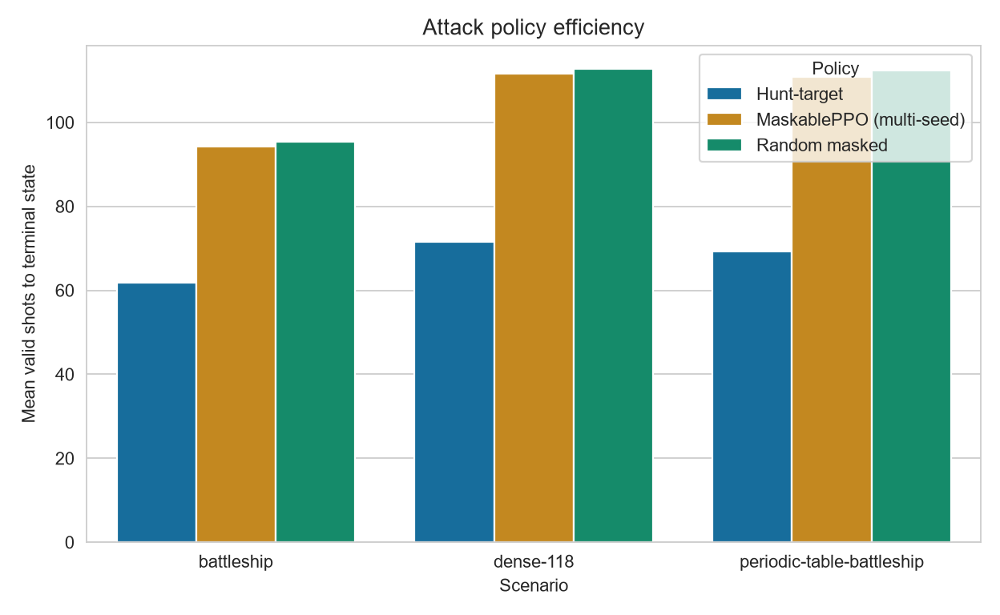

# Resultados e decisoes

## Resumo de desempenho (v0.9)

| Politica | Melhor metric reportada | Contexto | Status |
| --- | ---: | --- | --- |
| `belief_probability_mc-v1` | 35.0–44.5 tiros por topologia | comparação smoke 3 cenarios | ganho em validação reduzida, sem aprovacao de gate |
| `hunt-target-v1` | 51.0, 61.0, 64.0 tiros | baseline em 3 cenarios | referencia principal |
| `bayesian-cnn-student-v1` | 79.0 tiros (`dense-118`) | campanha multi-seed | nao promoveu |
| `bayesian-gnn-student-v1` | 66.25 tiros (`battleship`) | campanha multi-seed | nao promoveu |

## Decisao de promocao (v0.9)

- Na validação por smoke, `belief_probability_mc-v1` superou `hunt-target-v1`.
- A evidência foi considerada insuficiente para troca de baseline por:
  - cobertura de validação limitada (2 seeds),
  - ausência de janela robusta para todos os cenarios no mesmo protocolo final,
  - sem margem de generalizacao multi-seed para os estudantes CNN/GNN.
- Mantemos `hunt-target-v1` como baseline principal nesta release.

## Evidencias principais

- [Calibracao do amostrador v0.9](https://github.com/djairofilho/periodic-table-battleship-rl/blob/main/artifacts/v0.9-bayes-sampler-calibration/belief-sampler-calibration-v0.9.md)
- [Ablacao dos samplers v0.9](https://github.com/djairofilho/periodic-table-battleship-rl/blob/main/artifacts/v0.9-bayes-sampler-ablation/belief-sampler-ablation-v0.9.md)
- [Validacao multi-topologia v0.9 (smoke)](https://github.com/djairofilho/periodic-table-battleship-rl/blob/main/artifacts/v0.9-bayes-cross-topology-validation/smoke/bayes-cross-topology-v0.9.json)
- [Manifesto de demonstrations v0.9](https://github.com/djairofilho/periodic-table-battleship-rl/blob/main/artifacts/v0.9-demonstrations/dataset-manifest-v0.9.json)
- [Resumo dos estudantes v0.9](https://github.com/djairofilho/periodic-table-battleship-rl/blob/main/artifacts/v0.9-bayesian-students/bayesian-student-v0.9-summary.md)

## Graficos

